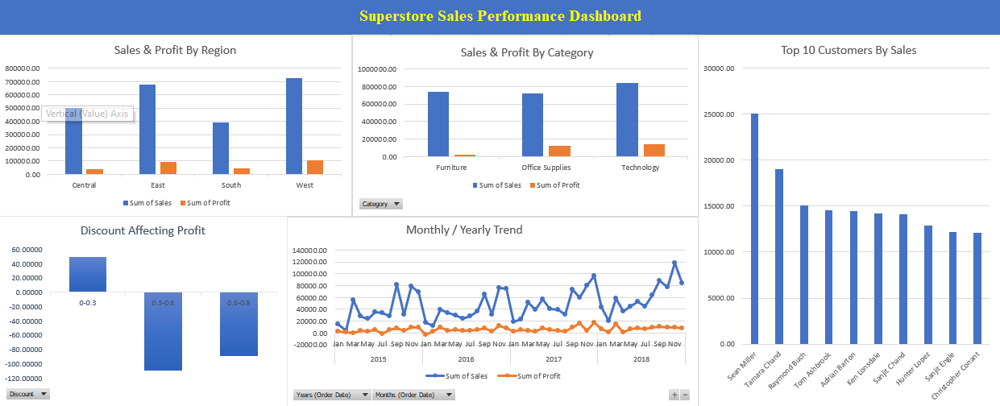

# Superstore Sales Analysis

Analysis of retail sales data using SQL and Excel, uncovering business insights around regional performance, product profitability, customer behavior, and the impact of discounting on profit margins.

## Tools Used
- MySQL (SQL queries for data analysis)
- Excel (Pivot Tables and dashboard visualization)

## Key Findings
- The West region generates the highest Sales and Profit, while Central has strong Sales but the lowest Profit margin.
- Technology is the most profitable category, while Furniture has the lowest profit due to losses in the Tables sub-category.
- Discounts above 30% consistently result in negative average profit, while discounts under 30% remain profitable.
- Technology products have the highest return rate (7.94%) when normalized against total orders, despite Office Supplies having a higher raw return count.

## Files
- `queries.sql` — All SQL queries used for the analysis
- `insights.docx` — Full written business insights
- `dashboard.png` — Excel dashboard visualizing key metrics

## Dashboard Preview

## About Me
Fresh CS graduate, currently building practical skills in SQL, Excel, and data analysis. Open to entry-level Data Analyst internships/roles — feel free to connect on [LinkedIn](https://www.linkedin.com/in/arham-zaman/).
